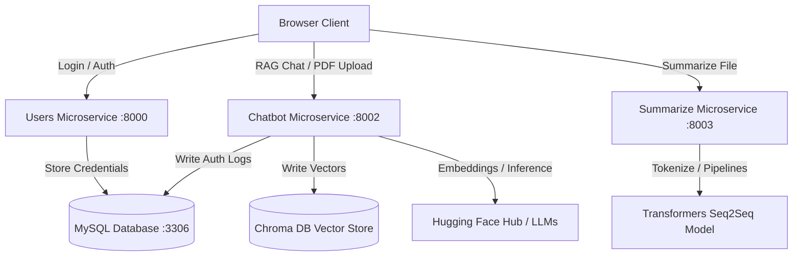

# Dockerized Microservices RAG Chatbot & Summarizer 📦

## Overview
This repository contains a containerized, production-grade microservices system designed for document analysis and interactive conversational retrieval. The system is split into three decoupled services: a User Authentication service, a Retrieval-Augmented Generation (RAG) Chatbot service, and a Seq2Seq Summarization service. The entire application is orchestrated using Docker Compose and backed by a MySQL database.

## Problem Statement
Monolithic AI applications are difficult to scale, test, and deploy. Furthermore, standard chatbots lack context-awareness, and parsing complex documents or URLs for semantic search requires integrating multiple components (PDF extractors, embeddings, vector databases, and LLM providers) under a secure, authenticated framework.

## Solution
This project implements a decoupled, containerized system to address these limitations:
1. **Orchestrated Microservices**: Decouples authentication, document retrieval, and text summarization.
2. **User Authentication Service**: Manages accounts and issues OAuth2 / JWT security tokens.
3. **RAG-based Chatbot Service**: Extracts text from PDFs and URLs, generates Hugging Face embeddings, stores chunks in Chroma DB, and retrieves context to generate responses via Hugging Face Hub LLMs.
4. **Text Summarization Service**: Employs Hugging Face Transformers pipelines and NLTK preprocessing to summarize uploaded documents.
5. **Docker Integration**: Restricts container traffic within a secure virtual network.

## Features
* **Role-Based Token Verification**: Secure APIs utilizing JWT and OAuth2 database checks.
* **Vector Embeddings Pipeline**: Interactive document uploads mapped into Chroma DB.
* **Dynamic Web Scraping**: URL page parsing with automated HTML-to-markdown conversion.
* **Transformer-Based Summarization**: Automatic summary extraction from text files.
* **Docker Compose Orchestration**: Quick configuration of databases and services.

## Architecture
The system architecture consists of three microservices and a database:



## Technology Stack
* **Infrastructure**: Docker, Docker Compose, MySQL.
* **Languages**: Python (FastAPI), JavaScript.
* **AI/ML & NLP Libraries**: LangChain, ChromaDB, Hugging Face Hub API, Transformers, NLTK, PyMuPDF (fitz), Markdownify.
* **Security**: PyJWT, Passlib (bcrypt), Cryptography.
* **ORM**: SQLAlchemy.

## Installation
### Prerequisites
* Docker & Docker Compose installed.
* A Hugging Face Hub Access Token (`HUGGINGFACEHUB_API_TOKEN`).

### Step-by-Step Launch
1. Clone the repository and configure environment variables.
2. Create `.env` files in each service directory:
   * **`users/app/.env`**:
     ```env
     DATABASE_URL=mysql+pymysql://root:password@db:3306/usersdb
     JWT_SECRET=your_jwt_secret
     ```
   * **`chatbot/app/.env`**:
     ```env
     HUGGINGFACEHUB_API_TOKEN=your_huggingface_token
     DATABASE_URL=mysql+pymysql://root:password@db:3306/usersdb
     ```
3. Run the orchestration command:
   ```bash
   docker-compose up --build
   ```
4. The database migrations and services will initialize. The endpoints will map to:
   * Users Service: `http://localhost:8000`
   * Chatbot Service: `http://localhost:8002`
   * Summarize Service: `http://localhost:8003`

## Usage
* **User Login**: Send a POST request to `/token` in the Users service with username and password to receive a JWT.
* **PDF Ingestion**: Submit a POST request to `/upload-pdf` in the Chatbot service with a valid JWT and a PDF file to chunk and ingest.
* **RAG Conversational Query**: Call `/chat` with a query to search the Chroma DB index and generate answers.
* **Summarization**: Send a text file to `/summarize` in the Summarize service to generate summaries.

## Results
* **RAG Pipeline**: Highly accurate vector retrieval using LangChain's conversational chain.
* **Containerization**: Reduced development-to-production friction.

## Screenshots
*(Provide links or placeholders to repository social previews)*
* **Docker Compose Log Output**: `[Insert Log Output Image]`
* **FastAPI Swagger Docs UI**: `[Insert Swagger API Screenshot]`

## Future Improvements
* Implement an API Gateway (like Kong or Nginx) to unify all three microservices under a single entry port.
* Add Redis for distributed API token caching.
* Support asynchronous task execution for document summarization using Celery and RabbitMQ.

## Project Structure
```text
microservices-rag-chatbot/
├── chatbot/                   # Chatbot microservice
│   ├── app/                   # Main script, RAG pipeline code
│   ├── Dockerfile
│   └── requirements.txt
├── summarize/                 # Text summarization service
│   ├── app/                   # NLTK / Transformer pipelines script
│   ├── Dockerfile
│   └── requirements.txt
├── users/                     # JWT User service
│   ├── app/                   # Auth routes, SQLAlchemy models, CRUD operations
│   ├── Dockerfile
│   └── requirements.txt
├── docker-compose.yml         # Main orchestration configuration
└── README.md                  # Main guide
```

## Contributing
See [CONTRIBUTING.md](CONTRIBUTING.md) for coding and documentation styling rules.

## License
Distributed under the MIT License. See `LICENSE` for details.

## Contact
Eswar Melam - [LinkedIn](https://linkedin.com/in/eswar-melam) - eswar.melam@gmail.com
